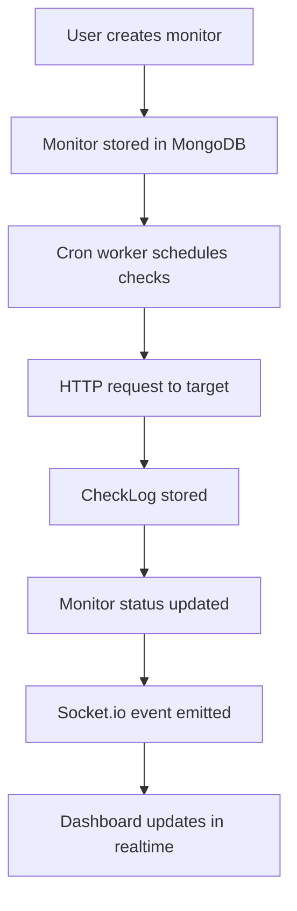

<p align="center">
	
</p>

<p align="center">
	
	
	
	
	
	
</p>

## What Is PulseCheck

PulseCheck is a production-style uptime monitoring SaaS that tracks website health, logs response times, and delivers live status updates through WebSockets. The system is designed as a layered backend with clear separation of concerns, Redis-backed controls, and a client dashboard focused on clarity and speed.

## Table of Contents

1. Product Vision
2. Feature Highlights
3. Realtime Monitoring Flow
4. Tech Stack
5. Architecture
6. Project Structure
7. API Surface
8. Environment Variables
9. Local Setup
10. Stripe Subscription Notes
11. Operational Notes
12. Roadmap

## Product Vision

PulseCheck is built for makers who need a clean, reliable visibility layer for their services:

- Monitor uptime and response time with minimal configuration.
- Receive realtime status updates without dashboard refresh.
- Enforce plan limits and interval rules in a clear, auditable way.

## Feature Highlights

| Domain | Capability | Details |
| --- | --- | --- |
| Auth | JWT-based login with bcrypt hashing | Secure register and login flow |
| Plans | FREE and PRO plan rules | Monitor limits and interval enforcement |
| Monitoring | Scheduled uptime checks | Background worker executes due monitors |
| Telemetry | Check logs with response timing | Status history and latency tracking |
| Realtime | Socket.io status updates | Live monitor status changes per user |
| Performance | Redis rate limiting and caching | Throttled auth and cached monitor lists |
| UI | Dashboard with skeleton states | Fast feedback and custom toasts |

## Realtime Monitoring Flow



## Tech Stack

### Frontend (client)

- React
- Vite
- React Router
- Axios
- socket.io-client

### Backend (server)

- Node.js + Express
- MongoDB + Mongoose
- Redis + ioredis
- JWT + bcrypt
- node-cron
- Socket.io

## Architecture

### Backend Layering

- Controllers: HTTP request and response shaping
- Services: business rules, plan enforcement, cache invalidation
- Repositories: MongoDB data access
- Models: schema and persistence
- Workers: interval-driven uptime checks and status updates

### Realtime Updates

- User rooms are established on socket connection
- Status changes emit targeted events to the owning user room
- The client listens and patches the local state for instant UI feedback

## Project Structure

```text
PulseCheck/
	client/
		src/
			components/
			context/
			pages/
			services/
			App.jsx
			index.css
			main.jsx
		.env.example
		package.json
	server/
		src/
			config/
			middlewares/
			modules/
				auth/
				checks/
				monitors/
				subscription/
			sockets/
			utils/
			workers/
			app.js
			server.js
		.env.example
		package.json
	README.md
```

## API Surface

Base URL (development): http://localhost:5000/api

### Auth

- POST /auth/register
- POST /auth/login

### Monitors

- GET /monitors
- POST /monitors
- DELETE /monitors/:id

### Checks

- GET /checks/:monitorId

### Subscription

- POST /subscription/checkout
- POST /subscription/webhook

## Environment Variables

### Server (.env in server/)

```env
PORT=5000
MONGO_URI=mongodb://127.0.0.1:27017/pulsecheck
REDIS_URL=redis://127.0.0.1:6379
JWT_SECRET=replace_with_a_secure_secret
JWT_REFRESH_SECRET=replace_with_a_second_secure_secret
CLIENT_URL=http://localhost:5173
STRIPE_SECRET_KEY=sk_test_...
STRIPE_PRO_PRICE_ID=price_...
STRIPE_WEBHOOK_SECRET=whsec_...
ALLOW_MANUAL_PLAN_UPDATES=false
```

### Client (.env in client/)

```env
VITE_API_BASE_URL=http://localhost:5000/api
VITE_SOCKET_URL=http://localhost:5000
```

## Local Setup

### Prerequisites

- Node.js 18+
- MongoDB
- Redis
- Stripe account for subscription testing

### 1) Install dependencies

```bash
cd server
npm install

cd ../client
npm install
```

### 2) Start backend

```bash
cd server
npm run dev
```

### 3) Start frontend

```bash
cd client
npm run dev
```

Typical frontend dev URL: http://localhost:5173

## Stripe Subscription Notes

- Checkout endpoint: POST /api/subscription/checkout
- Webhook endpoint: POST /api/subscription/webhook
- Manual plan changes are blocked unless `ALLOW_MANUAL_PLAN_UPDATES=true`

### Stripe test checkout

```text
Card: 4242 4242 4242 4242
Expiry: Any future date, such as 12/34
CVC: Any 3 digits
ZIP/postal code: Any value
```

Webhook event types:

- checkout.session.completed
- customer.subscription.updated
- customer.subscription.deleted

## Operational Notes

- MongoDB and Redis must be running before the backend starts.
- The worker runs every minute and checks only due monitors.
- FREE plan: max 5 monitors, minimum 5 minute interval.
- PRO plan: max 50 monitors, minimum 1 minute interval.
- Sidebar navigation scrolls between dashboard sections without changing the URL.

## Roadmap

- Add analytics filters and pagination on long lists
- Expand notification channels beyond dashboard updates
- Add tests for service and worker logic
